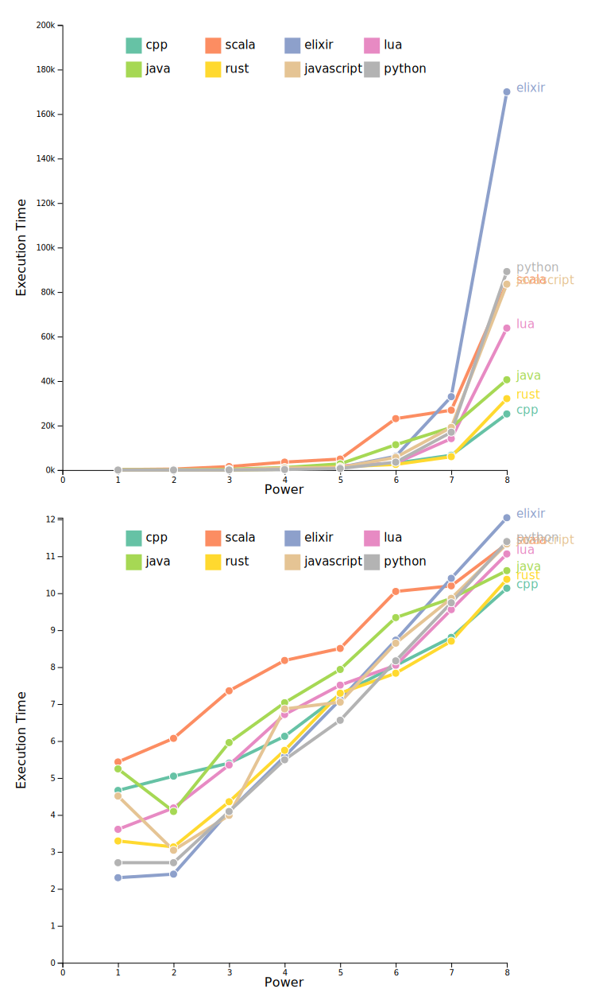

# Sum of prime numbers with multiple languages

## Description

The project allows to see the difference of speed of program's execution between multiple languages with one algorithm which computes the sum of prime numbers.
Also, the goal is to use native libraries for each language.

Languages:
* C++
* Scala
* Elixir
* Python
* Rust
* Java
* Lua
* Javascript

## Algorithm used

```python
def P10(n):
    r = int(n ** 0.5)
    assert r * r <= n and (r + 1) ** 2 > n
    V = [n // i for i in range(1, r + 1)]
    V += list(range(V[-1] - 1, 0, -1))
    S = {i: i * (i + 1) // 2 - 1 for i in V}
    for p in range(2, r + 1):
        if S[p] > S[p - 1]:  # p is prime
            sp = S[p - 1]  # sum of primes smaller than p
            p2 = p * p
            for v in V:
                if v < p2:
                    break
                S[v] -= p * (S[v // p] - sp)
    return S[n]
```

Here is the [source of the algorithm](https://stackoverflow.com/questions/4057527/need-help-optimizing-algorithm-sum-of-all-prime-numbers-under-two-million)

## Result

<!--  -->

## Limits

With low level languages such as C++, integers are limited to 64 bits.
In Rust, I don't have this problem, there are integers with 128 bits.
But for instance, with C++, there are some issues when I try to manipulate integers with 128 bits.
A solution could be to create a class `BigInt` where it simulates a 128 bits number with two attributes.
The maximum number that can be stored into a `unsigned long long` is `18,446,744,073,709,551,615`.
Since we want to go to a number written such as `999,9..,..9,999`, we are able to reach `9,999,999,999,999,999,999` (which is `10e20 - 1`) but we can't reach `10e21 - 1`.
Then, the first one would be all 19th first digits and the second one would be all digits upper to 10e20.

## Possible improvements

Elixir is a new functional programming language. There is almost no help you can find on the Internet to improve your code.
I'm a beginner with Elixir and I think there are some improvements that could be done to improve the speed of program's execution.

## Notes

The idea comes from the challenge Euler problem n°245 where there is a sum of prime numbers up to 10e11.
